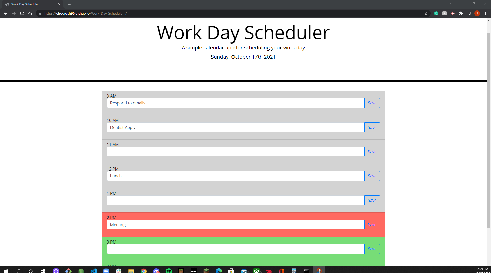

In this assingment, I was tasked with creating a functioning Work-Day-Planner for someone with a busy schedule. You will see that when the page is pulled up you are able to add tasks in each specific time block and save. After the save button is clicked, the input data gets set into the Local Storage and is stored there. The data is then pulled from the local storage to stay on the page after it has been refreshed. The time blocks are different colors indicating past, present and future events in your schedule.

https://elrodjosh96.github.io/Work-Day-Scheduler-/

